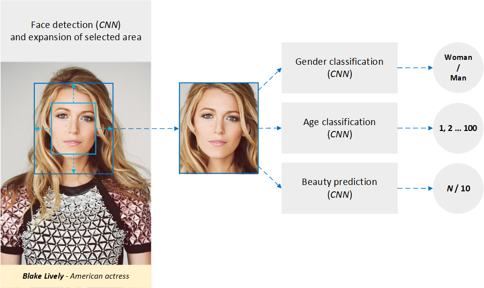
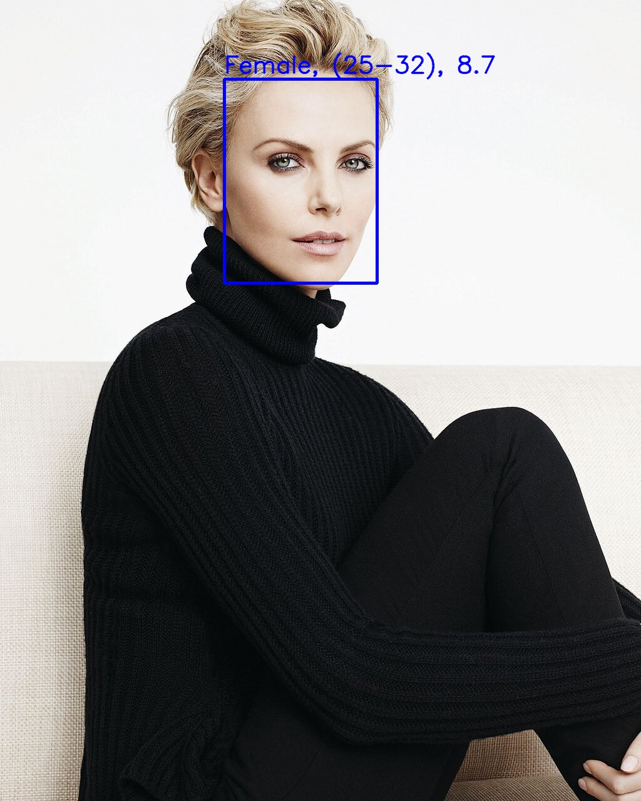
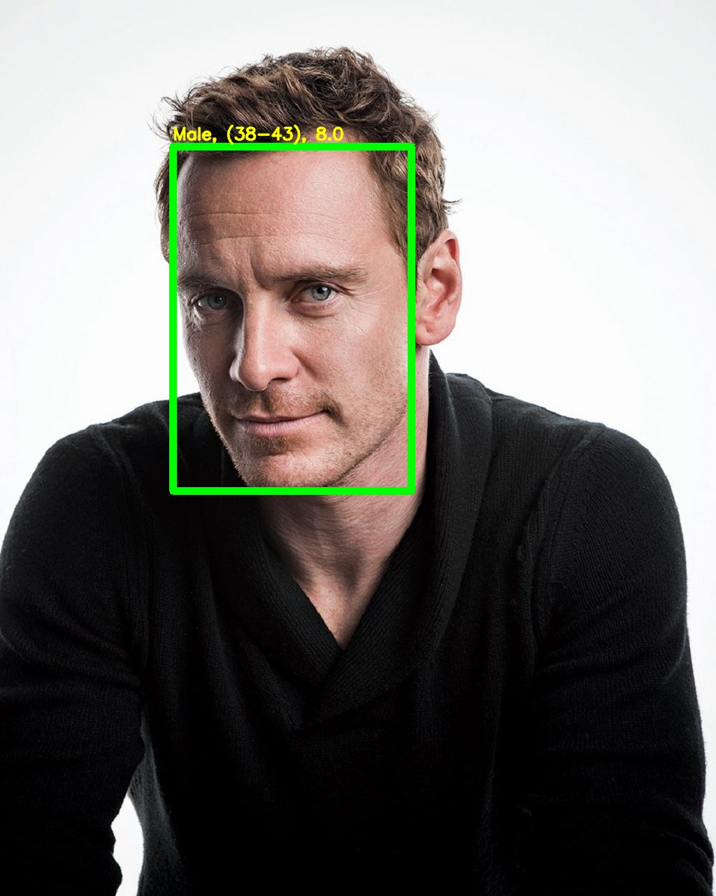

# HowBeautifulAmI
Python application for face detection and prediction age, gender and face beauty.

## Technique
As you know, the gender, age and beauty of a person is determined by his face. After detecting a face to obtain additional information about the face (hair, neck, ears, etc.), the selected area is artificially expanded while maintaining proportions. Then the expanded area of the face is cut into a separate image, to which convolutional neural networks are applied in turn to predict the gender, age and beauty of the face.
<p align="center"></p>

## Dependencies
Install python 3+ dependencies
- opencv-python  
- numpy  
- onnxruntime  
- argparse

## ONNX Models
| Model | Description | Download | ONNX version | Opset version | Dataset |
|:-------------|:--------------|:--------------|:--------------|:--------------|:--------------|
| face_detector_ultra_light_320 | Face detection | [1 MB](https://drive.google.com/file/d/1VfCqZgSFW7alMUfzxCnEH8r_NunOrqF2/view?usp=sharing)| 1.5 | 5 | Widerface |
| face_detector_ultra_light_640 | Face detection | [2 MB](https://drive.google.com/file/d/16NfgL14WXYT2LPQiBYpOr42m-pqkeaaI/view?usp=sharing)| 1.5 | 5 | Widerface |
| vgg_ilsvrc_16_age_chalearn_iccv2015 | Age classification | [513 MB](https://drive.google.com/file/d/1V75U1kUJ0udBLs6bg3lGqBk3ym8q9guV/view?usp=sharing) | 1.5 | 5 | ChaLearn LAP 2015 |
| vgg_ilsvrc_16_age_imdb_wiki | Age classification | [513 MB](https://drive.google.com/file/d/1ECle8EvsXiIid_vMa1_vwMJk6abhzrPF/view?usp=sharing)| 1.5 | 5 | IMDB-WIKI |
| vgg_ilsvrc_16_gender_imdb_wiki | Gender classification | [512 MB](https://drive.google.com/file/d/1epLM5ghucLcnGZg-NCIf1r16lotN004I/view?usp=sharing)| 1.5 | 5 | IMDB-WIKI |
| beauty_alexnet | Beauty prediction | [217 MB](https://drive.google.com/file/d/1uXoP3XDx8s5oyo6VszOnG9qU_1P9Pik-/view?usp=sharing)| 1.5 | 5 | SCUT-FBP5500 |
| beauty_resnet18 | Beauty prediction | [43 MB](https://drive.google.com/file/d/1gFGDBdKdiW1LWHMiPLMx6Tt9Y_0l7sOM/view?usp=sharing)| 1.5 | 5 | SCUT-FBP5500 |
| beauty_resnext50 | Beauty prediction | [88 MB](https://drive.google.com/file/d/1gR8Rr6BcH1BlC_gRVbeou7oxJRQ4-wWK/view?usp=sharing)| 1.5 | 5 | SCUT-FBP5500 |

**HowBeautifulAmI** models configuration
```python
face_model = "models/face_detector_ultra_light_640.onnx"
age_model = "models/vgg_ilsvrc_16_age_imdb_wiki.onnx"
gender_model = "models/vgg_ilsvrc_16_gender_imdb_wiki.onnx"
beauty_model = "models/beauty_resnet18.onnx"
```

## How to Use
```
usage: python howbeautifulami.py [-i] --input_image
```
<p align="center"></p>   

Results for **Charlize Theron** photo
```
Image: images/charlize.jpg
Detected faces: 1
Gender: Woman
Age: 37.3
Beauty: 8.5
```
and for **Michael Fassbender** photo
```
Image: images/michael.jpg
Detected faces: 1
Gender: Man
Age: 41.1
Beauty: 8.1
```

## License
**MIT**

## References
* Linzaer - [Ultra-lightweight face detection model](https://github.com/Linzaer/Ultra-Light-Fast-Generic-Face-Detector-1MB).
* Rothe et al. - [IMDB-WIKI – 500k+ face images with age and gender labels](https://data.vision.ee.ethz.ch/cvl/rrothe/imdb-wiki/).
* A diverse benchmark database for multi-paradigm facial beauty prediction - [SCUT-FBP5500](https://github.com/HCIILAB/SCUT-FBP5500-Database-Release).
* Microsoft - [ONNX Runtime](https://github.com/microsoft/onnxruntime).
* Caffe to ONNX: [unofficial converter](https://github.com/asiryan/caffe-onnx).
